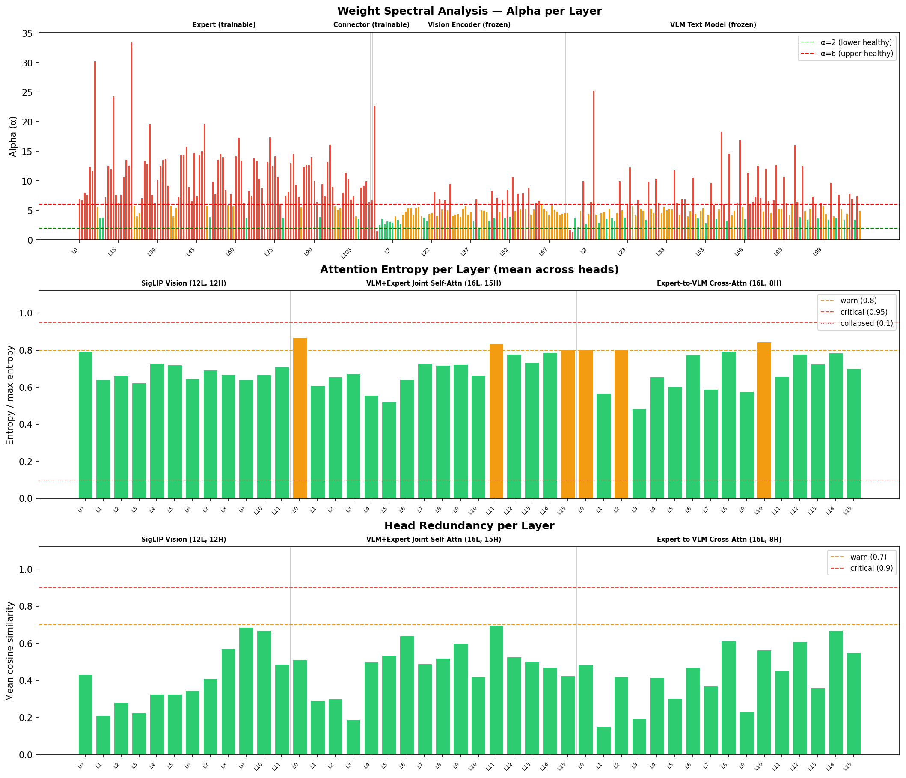
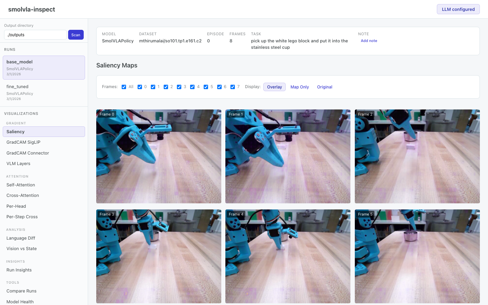
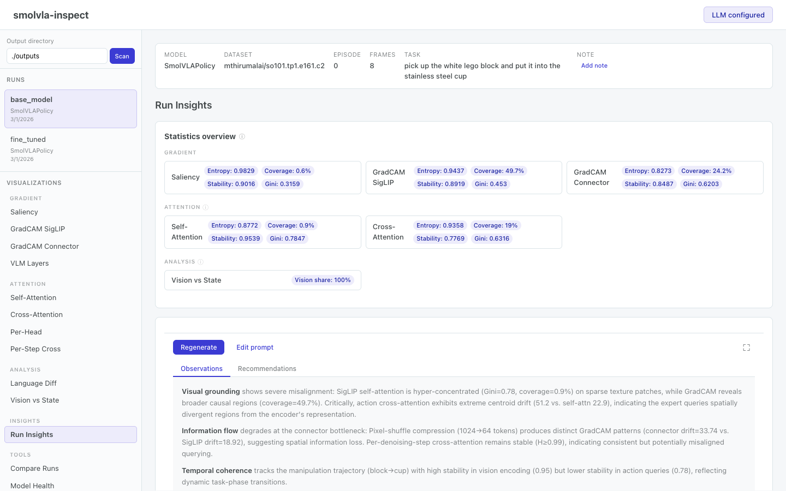
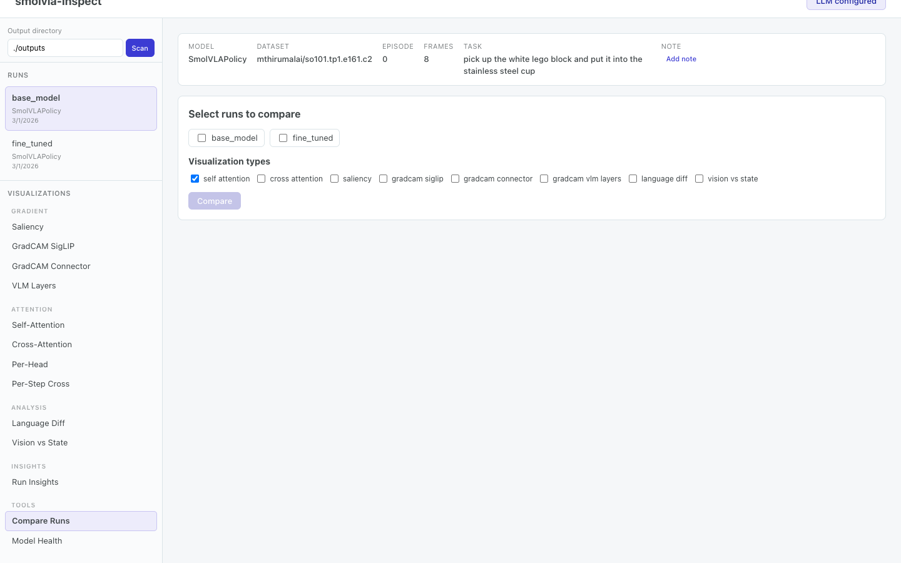

# smolvla-inspect

Inspect where a SmolVLA policy looks, what pixels actually drive its actions, and how its internal attention/weight structure behaves.


*Example inspection grid for a pick-and-place episode. It combines raw attention, overlays, and gradient attribution in one view.*

## Quick Start

```bash
# 1. Install
python3.11 -m venv .venv && source .venv/bin/activate
pip install -r requirements.txt   # macOS: brew install ffmpeg@6 first

# 2. Basic inspection (CPU)
./run.sh

# 3. With gradients (GPU)
./run.sh --config configs/gpu.yaml

# 4. Diagnostic agent — "why does my model fail?"
./run.sh diagnose --model your/model_id --dataset your/dataset_id --episode 0

# 5. MCP server — let AI agents query your runs
pip install "mcp>=1.0.0"
python inspect_attention.py mcp --base-dir ./outputs
```

Results are written to `outputs/`. Launch the web viewer with `./start_servers.sh`.

## What This Tool Does

SmolVLA is a vision-language-action policy: it takes camera images and a language instruction, then predicts robot actions. This repository gives you four ways to inspect that behavior:

| Capability | Flags | What it answers |
|------------|-------|-----------------|
| Attention visualization | default, `--cross-attention`, `--show-heads` | Where does the encoder or action decoder focus? |
| Gradient attribution | `--gradient`, `--gradcam-connector`, `--per-action-dim`, etc. | Which pixels causally affect the predicted action? |
| Model internals report | `--internals-only`, `--with-internals` | Are weights and attention heads well-behaved? |
| **Diagnostic agent** | `diagnose` subcommand | Why does my model fail? What should I fix first? |
| **MCP server** | `mcp` subcommand | Let AI agents query your runs directly |

The internals report runs spectral analysis (WeightWatcher), attention entropy, and head redundancy checks across the SigLIP encoder, VLM, action expert, connector, and projection heads.


*Example 3-panel internals report. Full markdown version: [assets/example_model_internals_report.md](assets/example_model_internals_report.md).*

For a visual walkthrough of the architecture, see [assets/architecture.md](assets/architecture.md).

## Diagnostic Agent

The diagnostic agent goes beyond visualization — it automatically answers "why does my model fail?" by running a six-stage pipeline:

1. **Scene understanding** — detects objects (OWL-ViT v2) and segments them (SAM) to create semantic regions
2. **Diagnostic matrix** — cross-references every signal type against every region to compute attribution mass
3. **Symptom detection** — flags issues like high background attribution, spatial shortcuts, dead state pathways
4. **LLM hypothesis formation** — selects the most discriminating counterfactual tests to run
5. **Counterfactual verification** — perturbs the scene (swap backgrounds, relocate objects, recolor, occlude) and measures action change
6. **Report synthesis** — produces ranked findings with evidence chains and actionable fixes

### Run modes

**Integrated** — full inspect + diagnose in one pass:

```bash
./run.sh diagnose \
    --model your/model_id --dataset your/dataset_id --episode 0 --device cuda
```

**Post-hoc** — analyze an existing run without re-loading the model:

```bash
./run.sh diagnose \
    --run-dir ./outputs/your_run_folder --dataset your/dataset_id
```

Add `--model your/model_id` to also run counterfactual tests (requires the model).

### LLM configuration

```bash
# Anthropic (default)
export ANTHROPIC_API_KEY=sk-ant-...

# OpenAI / compatible
export SMOLVLA_LLM_PROVIDER=openai
export SMOLVLA_LLM_MODEL=gpt-4o
export OPENAI_API_KEY=sk-...

# Local models via Ollama/vLLM
export SMOLVLA_LLM_PROVIDER=openai
export SMOLVLA_LLM_MODEL=llama3
export SMOLVLA_LLM_BASE_URL=http://localhost:11434/v1
export SMOLVLA_LLM_API_KEY=ollama
```

If no API key is set, the agent falls back to rule-based hypothesis generation — you still get the matrix, symptom detection, and counterfactual results, just without LLM-generated narrative.

<details>
<summary><strong>Extra dependencies</strong></summary>

```bash
pip install scipy
pip install git+https://github.com/facebookresearch/segment-anything.git
```

The SAM checkpoint (`sam_vit_b`) is downloaded automatically to `~/.cache/smolvla_inspect/` on first use. OWL-ViT v2 loads from HuggingFace via `transformers` (already a dependency). When SAM is unavailable, the agent falls back to bounding-box masks.

</details>

<details>
<summary><strong>Config options</strong></summary>

Use `configs/diagnostic.yaml` for defaults, or pass flags directly:

```bash
./run.sh diagnose --config configs/diagnostic.yaml \
    --model your/model_id --dataset your/dataset_id

# Control analysis depth
./run.sh diagnose --run-dir ./outputs/run_folder --dataset your/dataset_id \
    --max-counterfactuals 5 --max-hypotheses 8

# Skip counterfactuals (faster, no model needed)
./run.sh diagnose --run-dir ./outputs/run_folder --dataset your/dataset_id \
    --skip-counterfactuals
```

</details>

<details>
<summary><strong>Output layout</strong></summary>

```text
run_folder/
  diagnostic/
    report.json          # Structured report (machine-readable)
    report.md            # Full narrative report (human-readable)
    matrix.json          # Attribution mass matrix
    scene/
      detections.json    # Detected objects with boxes/scores
      segmentation.npz   # Per-object binary masks
      annotated_frame.png
    counterfactuals/
      background_substitution/
        comparison.png   # Side-by-side original vs modified
        result.json      # Action delta, GradCAM shift
      object_relocation/
        comparison.png
        result.json
    evidence_chain.json  # Full evidence log

# Generated by `regenerate_report.py compare`:
parent_folder/
  comparison_report.json # Cross-run comparison (machine-readable)
  comparison_report.md   # Cross-run comparison (human-readable)
```

</details>

<details>
<summary><strong>Detected symptoms</strong></summary>

| Symptom | Severity | What it means |
|---------|----------|---------------|
| High background attribution | Critical/Warning | Model relies on background features, not task objects |
| Spatial shortcut | Critical | Model memorized object positions instead of recognizing them |
| Low object attribution | Critical/Warning | GradCAM shows the target object has minimal causal influence |
| Attention-GradCAM divergence | Warning | Model looks at regions it doesn't use (or vice versa) |
| Dead state pathway | Warning | Proprioceptive state input is being ignored |
| Language insensitivity | Warning | Changing the task instruction doesn't shift visual attention |
| Unstable GradCAM | Info | Gradient attribution varies significantly across frames |

</details>

### Regenerate reports & compare runs

`regenerate_report.py` re-renders reports from saved JSON without needing torch or a GPU:

```bash
# Re-render a single diagnostic report (e.g. after changing the template)
python regenerate_report.py outputs/mthirumalai/finetuned_model

# Compare two or more diagnostic runs
python regenerate_report.py compare outputs/mthirumalai/base_model outputs/mthirumalai/finetuned_model

# With labels and custom output directory
python regenerate_report.py compare dir1 dir2 --labels "baseline" "finetuned" --output-dir ./results
```

The comparison produces `comparison_report.json` and `comparison_report.md` with attribution deltas, counterfactual deltas, and weight spectral changes across runs.

The diagnostic is also available in the web viewer — select a run, then click "Diagnostic Agent" in the sidebar.

## MCP Server (AI Agent Integration)

The MCP server exposes **48 read-only tools** via the [Model Context Protocol](https://modelcontextprotocol.io/), so any MCP-compatible client can query your inspection runs, diagnostic reports, and comparison data directly — no web viewer needed.

Works with: **Claude Code**, **Cursor**, **Windsurf**, **Continue**, **Zed**, and any custom MCP client.

### Quick start

```bash
# Install the MCP dependency
pip install "mcp>=1.0.0"

# Test the CLI
python inspect_attention.py mcp --help
```

### Verify it works

Use the [MCP Inspector](https://modelcontextprotocol.io/docs/tools/inspector) to verify the server is working — it's a browser-based developer tool that lets you browse all 48 tools, call them with parameters, and see the raw JSON responses:

```bash
npx @modelcontextprotocol/inspector python inspect_attention.py mcp --base-dir ./outputs
```

The Inspector calls your real server against real data, so you can confirm tools return correct results before registering with a client.

For the full natural-language experience ("compare these two runs and tell me what changed"), register the server with an MCP client that has an LLM behind it (see below).

### Register with your MCP client

<details>
<summary><strong>Claude Code</strong></summary>

Add to `.mcp.json` in your project root:

```json
{
  "mcpServers": {
    "smolvla-inspect": {
      "command": "python",
      "args": ["inspect_attention.py", "mcp", "--base-dir", "./outputs"],
      "cwd": "/path/to/smolvla-inspect"
    }
  }
}
```

</details>

<details>
<summary><strong>Cursor / Windsurf / other MCP clients</strong></summary>

The server uses **stdio transport** — configure your client to spawn the process:

```
command: python inspect_attention.py mcp --base-dir ./outputs
cwd: /path/to/smolvla-inspect
```

Consult your client's docs for the exact config format.

</details>

Restart your client and the 48 tools appear automatically.

### Configuration

| Flag | Default | Description |
|------|---------|-------------|
| `--base-dir` | `./outputs` | Root directory to scan for runs |

`--base-dir` is set at server startup and stays fixed for the session — it can't be changed via natural language at runtime. The scanner walks the directory **recursively**, so any nested folder containing a `run_manifest.json` is discovered automatically.

If your runs are spread across multiple directories, point `--base-dir` at a common parent:

```json
"args": ["inspect_attention.py", "mcp", "--base-dir", "/path/to/all/experiments"]
```

To pick up runs in a new location, update `--base-dir` in your client config and restart.

### Example queries

| Query | Tool used |
|-------|-----------|
| "List all runs" | `list_runs` |
| "Show details for run X" | `get_run_detail` |
| "What symptoms did the diagnostic find?" | `get_symptoms` |
| "Compare these two runs" | `compare_diagnostic_runs` |
| "What does self-attention look like for frame 0?" | `get_attention_heatmaps` |
| "Build a matrix of findings across models and datasets" | `compare_matrix` |
| "What hypothesis templates are available?" | `list_hypothesis_templates` |

<details>
<summary><strong>Tool categories (48 tools)</strong></summary>

| Category | Count | Tools |
|----------|-------|-------|
| Discovery | 8 | `list_runs`, `search_runs`, `get_run_detail`, `tag_run`, `untag_run`, `rescan_runs`, `validate_run`, `add_run` |
| Inspection | 12 | `get_attention_heatmaps`, `get_gradient_attribution`, `get_per_head_attention`, `get_per_step_cross_attention`, `get_vlm_layers`, `get_per_action_dim`, `get_language_diff`, `get_vision_vs_state`, `get_model_internals`, `get_frame_image`, `list_run_images`, `get_frames` |
| Statistics | 3 | `get_viz_stats`, `get_run_summary_stats`, `format_stats_for_prompt` |
| Diagnostic | 11 | `get_diagnostic_report`, `get_symptoms`, `get_hypotheses`, `get_findings`, `get_evidence_chain`, `get_diagnostic_matrix`, `get_scene_data`, `get_counterfactual_result`, `get_semantic_probe`, `get_qk_probe`, `get_spatial_object_diagnosis` |
| Comparison | 5 | `compare_diagnostic_runs`, `compare_run_configs`, `compare_component_weights`, `compare_heatmaps`, `compare_matrix` |
| Registry | 7 | `list_primitives`, `list_signals`, `list_hypothesis_templates`, `list_symptom_detectors`, `get_primitive_detail`, `get_counterfactual_tests`, `get_signal_descriptions` |
| Notes | 2 | `get_run_notes`, `set_run_notes` |

</details>

## Setup

### Requirements

- Python 3.10+
- FFmpeg 4-7 for video decoding through TorchCodec
- Node.js 20.19+ for the web viewer (optional)

### macOS

```bash
brew install ffmpeg@6
python3.11 -m venv .venv && source .venv/bin/activate
pip install -r requirements.txt
brew install node   # optional, for web viewer
```

### Ubuntu + CUDA

```bash
chmod +x clone-and-setup.sh && ./clone-and-setup.sh
```

Or if the repo is already cloned:

```bash
chmod +x setup-gpu.sh && ./setup-gpu.sh
```

`setup-gpu.sh` installs CUDA-compatible PyTorch, creates a virtualenv, installs dependencies, and checks GPU access.

On Ubuntu, the default `apt install nodejs` is often too old. Prefer [NodeSource](https://github.com/nodesource/distributions) or `nvm`.

## Run

```bash
source .venv/bin/activate
./run.sh                              # basic inspection
./run.sh --config configs/gpu.yaml    # with gradients
./run.sh --internals-only             # model internals report only
```

If calling Python directly (macOS):

```bash
export DYLD_LIBRARY_PATH="/opt/homebrew/opt/ffmpeg@6/lib:$DYLD_LIBRARY_PATH"
python inspect_attention.py
```

### Config files

Defaults come from `configs/defaults.yaml`. Use `--config` to load another; CLI flags override config values.

| Config | Purpose |
|--------|---------|
| `configs/defaults.yaml` | Conservative CPU-friendly defaults |
| `configs/gpu.yaml` | CUDA-oriented config with gradients and extended attribution |
| `configs/diagnostic.yaml` | Diagnostic agent defaults |

<details>
<summary><strong>Common commands</strong></summary>

#### Basic attention

```bash
./run.sh --model path/to/checkpoint --dataset path/to/dataset
./run.sh --episode 3 --num-frames 12
./run.sh --task "pick up the red cube"
./run.sh --method last-layer
./run.sh --raw-attention
./run.sh --attn-threshold 0.7
```

#### Gradient attribution

```bash
./run.sh --gradient
./run.sh --gradient saliency --smooth-grad 20
./run.sh --device mps --gradient both --gradient-device cpu
```

#### Extended attribution

```bash
./run.sh --cross-attention --per-step-cross-attention
./run.sh --gradient gradcam --gradcam-connector --gradcam-vlm-layers 4,8,12,16
./run.sh --gradient gradcam --vision-vs-state
./run.sh --gradient gradcam --per-action-dim
./run.sh --language-diff "pick up the blue cube"
```

#### Model internals

```bash
./run.sh --internals-only
./run.sh --with-internals
./run.sh --internals-only --internals-frames 10
./run.sh --internals-only --entropy-warn 0.85 --redundancy-warn 0.75
```

Backward-compatible aliases `--model-health` and `--health-frames` are still accepted.

</details>

### Output layout

With `--export-data` enabled, each run gets a structured folder under `outputs/`:

```text
run_YYYY-MM-DD_HH-MM-SS/
  images/
  data/
  run_manifest.json
```

That structure is what the web viewer reads.

## Web Viewer

The web viewer lets you browse runs, inspect frames interactively, compare runs side by side, view model internals, and attach LLM-generated analysis.


*Browsing per-frame visualizations in the main viewer.*


*Run Insights summarizes statistics across a run and supports LLM analysis.*


*Compare multiple runs side by side.*

### Development launch

```bash
source .venv/bin/activate
./start_servers.sh
./start_servers.sh --base-dir ./my_outputs
```

This starts the backend on `http://localhost:8080` and frontend on `http://localhost:5173`.

### Production-style launch

```bash
cd web/frontend && npm install && npm run build && cd ../..
python inspect_attention.py serve --port 8080 --base-dir ./outputs
```

Set `ANTHROPIC_API_KEY` or `OPENAI_API_KEY` before launching if you want LLM analysis.

| Flag | Default | Description |
|------|---------|-------------|
| `--port` | `8080` | Server port |
| `--host` | `0.0.0.0` | Server host |
| `--base-dir` | `./outputs` | Root directory scanned for runs |
| `--no-open` | off | Do not auto-open the browser |

## How It Works


*Left: where attention is captured. Right: how patch attention becomes a spatial heatmap.*

1. Load a SmolVLA policy and a LeRobot dataset.
2. Capture self-attention from the SigLIP vision encoder.
3. Optionally capture action-expert cross-attention into the VLM prefix.
4. Convert patch-level scores into spatial heatmaps.
5. Optionally compute gradients, GradCAM, or extended attribution views.
6. Save images plus structured data for the viewer.

### Main dashboard rows

| Row | Content | When shown |
|-----|---------|------------|
| 1 | Original frame | always |
| 2 | SigLIP self-attention heatmap | always |
| 3 | Action cross-attention heatmap | `--cross-attention` |
| 4 | Saliency / SmoothGrad overlay | `--gradient saliency` or `both` |
| 5 | Self-attention overlay | always |
| 6 | Co-attention overlay | `--cross-attention` |
| 7 | GradCAM overlay (SigLIP) | `--gradient gradcam` or `both` |
| 8 | GradCAM overlay (Connector) | `--gradcam-connector` |
| 9 | Language-conditional diff | `--language-diff` |

With `--show-heads`, the first frame gets a separate 12-head SigLIP grid:


*Look for specialization: some heads should track objects, gripper geometry, or broader scene structure.*

## Interpreting Results

<details>
<summary><strong>Self-attention patterns</strong></summary>

| Pattern | Interpretation |
|---------|----------------|
| Bright on gripper, object, and goal | good task-relevant visual focus |
| Bright on shelves, cables, or table texture | possible background shortcut |
| Uniform / diffuse everywhere | weak or unfocused visual features |
| Focus shifts sensibly over time | model is tracking task progression |

</details>

<details>
<summary><strong>Cross-attention patterns</strong></summary>

| Pattern | Interpretation |
|---------|----------------|
| Tight focus on gripper tip and target object | decoder is reading useful vision tokens |
| Diffuse over all vision tokens | decoder has not specialized well |
| Self-attn diffuse but cross-attn focused | decoder is filtering noisy encoder features |
| Self-attn focused but cross-attn diffuse | encoder is better than the decoder's use of it |

</details>

<details>
<summary><strong>Gradient attribution patterns</strong></summary>

| Pattern | Interpretation |
|---------|----------------|
| Saliency highlights object / gripper edges | action depends on relevant pixels |
| GradCAM agrees with attention | representation and causal signal align |
| Attention focused but saliency diffuse | model may look there without using it |
| Saliency spikes on irrelevant structure | likely shortcut or bias |

</details>

<details>
<summary><strong>Extended attribution checks</strong></summary>

| Feature | What to look for |
|---------|-----------------|
| Per-step cross-attention | focus should sharpen over denoising steps |
| Connector GradCAM | should broadly agree with SigLIP GradCAM at coarser resolution |
| VLM layer GradCAM | later layers should become more task-specific |
| Vision vs. state | extreme imbalance can indicate one modality is ignored |
| Per-action-dim | different joints should not all attend to identical regions |
| Language diff | changing the instruction should move visual emphasis |

</details>

<details>
<summary><strong>Attention vs. gradient</strong></summary>

| Case | Meaning |
|------|---------|
| High attention, low gradient | model represents the region but may not rely on it |
| Low attention, high gradient | subtle but causally important region |
| High attention, high gradient | strongest evidence of behavior-driving focus |

</details>

<details>
<summary><strong>Model internals thresholds</strong></summary>

| Metric | Healthy | Warning | Critical |
|--------|---------|---------|----------|
| Spectral alpha | 2-4 | 4-6 | >6 or <2 |
| Attention entropy | 0.10-0.80 | >0.80 | >0.95 or <0.10 |
| Head redundancy | <0.70 | >0.70 | >0.90 |

The report covers three attention components:

| Report component | Architecture operation |
|-----------------|------------------------|
| SigLIP Vision (12L, 12H) | self-attention inside the vision encoder |
| VLM+Expert Joint Self-Attn (16L, 15H) | joint prefill self-attention |
| Expert-to-VLM Cross-Attn (16L, 8H) | action decoding cross-attention |

</details>

**Split-device tip**: If MPS backward is unstable, run attention on MPS and gradients on CPU:

```bash
./run.sh --device mps --gradient both --gradient-device cpu
```

## CLI Reference

<details>
<summary><strong>Diagnostic agent (<code>diagnose</code> subcommand)</strong></summary>

| Flag | Default | Description |
|------|---------|-------------|
| `--run-dir` | off | Path to existing run directory (post-hoc mode) |
| `--model` | off | HuggingFace model ID or local path |
| `--dataset` | off | LeRobot dataset ID or local path |
| `--episode` | `0` | Episode index |
| `--image-key` | auto | Dataset image key |
| `--image-map` | off | Explicit image key mapping |
| `--config` | off | Diagnostic config YAML path |
| `--device` | auto | `cuda`, `mps`, or `cpu` |
| `--output-dir` | `./outputs` | Output directory |
| `--max-counterfactuals` | `3` | Maximum counterfactual tests to run |
| `--skip-counterfactuals` | off | Skip counterfactual testing entirely |
| `--max-hypotheses` | `5` | Maximum hypotheses to generate |

</details>

<details>
<summary><strong>General flags</strong></summary>

| Flag | Default | Description |
|------|---------|-------------|
| `--config` | `configs/defaults.yaml` | Load defaults from a YAML config |
| `--model` | `lerobot/smolvla_base` | HuggingFace model ID or local path |
| `--dataset` | `lerobot/svla_so101_pickplace` | LeRobot dataset ID or local path |
| `--episode` | `0` | Episode index |
| `--num-frames` | `8` | Number of sampled frames |
| `--image-key` | auto | Dataset image key override |
| `--image-map` | off | Explicit dataset-to-policy image key mapping |
| `--task` | dataset value | Override language instruction |
| `--output-dir` | `./outputs` | Output directory |
| `--device` | `auto` | `auto`, `cpu`, `cuda`, `mps` |
| `--save-individual` | `true` | Save per-frame overlays as separate files |
| `--export-data` | `true` | Save structured run data for the web viewer |
| `--no-export-data` | off | Disable structured run export |
| `--run-name` | timestamped | Override the generated run folder name |

</details>

<details>
<summary><strong>Attention flags</strong></summary>

| Flag | Default | Description |
|------|---------|-------------|
| `--method` | `rollout` | `last-layer`, `rollout`, or `all-layers` |
| `--cross-attention` | `true` | Capture action-expert cross-attention |
| `--show-heads` | `true` | Save a per-head grid for frame 0 |
| `--raw-attention` | `false` | Skip positional baseline subtraction |
| `--attn-threshold` | `0.5` | Zero out low attention values after normalization |
| `--skip-attention` | `false` | Skip hook-based attention extraction and only run gradient features |

</details>

<details>
<summary><strong>Gradient and extended attribution flags</strong></summary>

| Flag | Default | Description |
|------|---------|-------------|
| `--gradient` | off | `saliency`, `gradcam`, or `both` |
| `--gradient-device` | same as `--device` | Device for gradient computation |
| `--gradient-seed` | `42` | Fixed seed for reproducibility |
| `--smooth-grad` | `1` | SmoothGrad sample count |
| `--smooth-grad-sigma` | `0.15` | SmoothGrad noise std |
| `--per-step-cross-attention` | `false` | Save cross-attention per denoising step |
| `--gradcam-connector` | `false` | GradCAM on connector output |
| `--gradcam-vlm-layers` | off | GradCAM on selected VLM layers |
| `--vision-vs-state` | `false` | Compare vision vs state attribution |
| `--per-action-dim` | `false` | Per-action-dimension GradCAM |
| `--language-diff` | off | Compare attribution between two task prompts |

</details>

<details>
<summary><strong>Model internals flags</strong></summary>

| Flag | Default | Description |
|------|---------|-------------|
| `--internals-only` | `false` | Run only the model internals report |
| `--with-internals` | `false` | Add the model internals report to a standard run |
| `--internals-frames` | `5` | Sampled frames for entropy / redundancy |
| `--entropy-warn` | `0.8` | Unfocused-head threshold |
| `--entropy-critical` | `0.95` | Dead-head threshold |
| `--entropy-low` | `0.1` | Collapsed-head threshold |
| `--redundancy-warn` | `0.7` | High-redundancy threshold |
| `--redundancy-critical` | `0.9` | Collapsed-redundancy threshold |

</details>

## Project Layout

<details>
<summary><strong>Directory structure</strong></summary>

```text
smolvla-inspect/
├── inspect_attention.py
├── regenerate_report.py         # Re-render reports & compare runs (no GPU needed)
├── smolvla_inspect/
│   ├── cli.py
│   ├── capture.py
│   ├── data.py
│   ├── export.py
│   ├── gradient.py
│   ├── heatmap.py
│   ├── internals.py
│   ├── serve.py
│   ├── viz.py
│   ├── _compat.py
│   ├── mcp/                    # MCP server (AI agent integration)
│   │   ├── __init__.py          # mcp_main() entry point
│   │   ├── server.py            # FastMCP instance
│   │   ├── context.py           # Settings singleton, resolve_run()
│   │   ├── helpers.py           # JSON serialization, base64, envelopes
│   │   ├── resources.py         # MCP resources (configs, registry, per-run)
│   │   └── tools/
│   │       ├── discovery.py     # 8 tools: list/search/tag/validate runs
│   │       ├── inspection.py    # 12 tools: heatmaps, gradients, images
│   │       ├── statistics.py    # 3 tools: viz stats, summary, formatted
│   │       ├── diagnostic.py    # 11 tools: report, symptoms, findings
│   │       ├── comparison.py    # 5 tools: cross-run comparisons
│   │       ├── registry_tools.py # 7 tools: primitives, signals, templates
│   │       └── notes.py         # 2 tools: get/set run notes
│   └── diagnostic/             # Diagnostic agent package
│       ├── __init__.py          # run_diagnostic() entry point
│       ├── agent.py             # DiagnosticAgent orchestrator
│       ├── comparison.py        # Cross-run comparison report
│       ├── counterfactual.py    # Counterfactual perturbation primitives
│       ├── diagnostic_cli.py    # CLI subcommand handler
│       ├── matrix.py            # Diagnostic matrix + symptom detectors
│       ├── models.py            # Data models (dataclasses + deserialisation)
│       ├── prompts.py           # LLM prompt templates
│       ├── regions.py           # Region attribution scoring
│       ├── registry.py          # Primitive registry
│       ├── report.py            # Report generation + export
│       ├── scene.py             # Scene understanding (OWL-ViT + SAM)
│       └── semantic_probe.py    # Semantic and QK probes
├── web/
│   ├── backend/
│   │   ├── routers/
│   │   │   └── diagnostic.py   # Diagnostic API endpoints
│   │   └── services/
│   │       └── diagnostic_service.py
│   └── frontend/
│       └── src/components/
│           ├── DiagnosticPanel.tsx
│           ├── DiagnosticMatrixTable.tsx
│           ├── FindingCard.tsx
│           └── CounterfactualComparison.tsx
├── assets/
├── configs/
│   └── diagnostic.yaml          # Diagnostic agent config
├── docs/
├── clone-and-setup.sh
├── setup-gpu.sh
├── start_servers.sh
├── run.sh
├── requirements.txt
└── README.md
```

</details>

## Roadmap

- [x] Gradient-based attribution
- [x] SmoothGrad
- [x] Extended attribution features
- [x] Config file support
- [x] Interactive web viewer
- [x] Agentic diagnostic system with counterfactual verification
- [x] MCP server for AI agent integration (48 read-only tools)
- [ ] Representation probing
- [ ] Causal tracing / activation patching
- [ ] Temporal consistency analysis

## Note on FFmpeg

If you linked `ffmpeg@6` and want to switch back later:

```bash
brew unlink ffmpeg@6 && brew link ffmpeg
```
