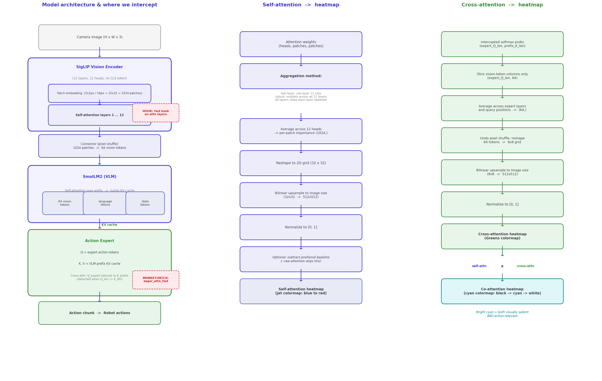

# smolvla-inspect

See what SmolVLA’s vision encoder is looking at when it predicts robot actions.

---

## What this does

SmolVLA is a **vision–language–action** policy: it takes camera images (and optionally language) and outputs robot actions. This repo **visualizes where the vision part “looks”** in each frame by extracting **attention maps** from the vision encoder and turning them into heatmaps over the images.

That lets you check whether the model is attending to task-relevant regions (e.g. gripper, object, goal) or to background (e.g. walls, table texture)—a useful signal for debugging overfitting or distribution shift.

**Input:** A pretrained or fine-tuned SmolVLA policy + a LeRobot dataset (e.g. episodes of pick-and-place).  
**Output:** For each chosen frame, (1) the original image, (2) an attention heatmap, and (3) an overlay of the heatmap on the image, plus a grid summary PNG.

---

## How it works (for data scientists)

  
*Left: Where the vision encoder lives and where we hook to capture attention. Right: How attention weights become a spatial heatmap.*

High-level pipeline:

1. **Load model and dataset**  
   The script loads a SmolVLA policy (e.g. `lerobot/smolvla_base`) and a LeRobot dataset. The dataset provides sequences of images and actions; we use the images as input and (optionally) actions only for reference.

2. **Locate the vision encoder**  
   SmolVLA is built from a **vision encoder** (SmolVLM/SigLIP-style Vision Transformer) plus a language/action head. The script finds the vision encoder inside the policy (e.g. `model.vlm_with_expert.vlm.model.vision_model`) so it can hook into it.

3. **Run a forward pass and capture self-attention**
   The vision encoder is a **Transformer**: it splits the image into **patches**, runs **self-attention** over those patches, and outputs patch-level features. The script:
   - Registers **forward hooks** on the encoder’s attention layers so that when we run a forward pass, we get the **attention weight matrices** (which patch “looks at” which).
   - To get weights, the code forces **eager** attention (instead of SDPA/Flash), which returns the full weight tensor.
   - For each frame, it builds a batch (with the right image keys and dtype), runs the vision encoder (or full policy), and the hooks record the attention.
   - **Aggregation methods** (`--method`): `last-layer` uses only the final encoder layer, `rollout` multiplies attention across all layers (accounting for residual connections) for a more complete picture of information flow, `all-layers` keeps each layer’s attention separately.

4. **Optionally capture cross-attention** (`--cross-attention`)
   SmolVLA doesn’t have explicit cross-attention layers. Instead, the VLM builds a **KV cache** from the prefix sequence (vision tokens + language tokens + state tokens), and the **action expert** queries that cache. The script monkey-patches `eager_attention_forward()` on the expert to intercept the softmax attention probabilities when expert queries attend to prefix keys (detected by Q seq-len != K seq-len). Only the columns corresponding to vision tokens are kept, giving a heatmap of which image regions the action decoder actually reads.

5. **Turn attention into a spatial heatmap**
   Attention is in **patch space** (e.g. 32×32 grid for SigLIP with 512px images and 16px patches). For each patch we get an “importance” score (mean attention received). Those scores are reshaped into a 2D grid, **upsampled** with bilinear interpolation to the original image size, and normalized to [0, 1]. That gives a single **heatmap** per frame (bright = high attention).

6. **Visualize**
   Default grid (3 rows per frame): **Row 1** original, **Row 2** self-attention heatmap, **Row 3** overlay. With `--cross-attention`, two extra rows are added: **Row 4** cross-attention heatmap (hot colormap), **Row 5** dual-color overlay (self-attention in blue, cross-attention in red). With `--show-heads`, a separate per-head grid is saved for the first frame.

**Fallback:** If the vision encoder can’t be hooked or attention isn’t captured (e.g. wrong architecture), the script can fall back to **input-gradient saliency**: backprop from the action output to the image pixels and use gradient magnitude as a proxy for “what the model uses.” That’s no longer true attention but still highlights influential pixels.

---

## Setup

**Requirements:** Python 3.10+, and FFmpeg 4–7 for video decoding (LeRobot uses TorchCodec). On macOS, Homebrew’s default `ffmpeg` is often v8; install FFmpeg 6 so the loader can find it:

```bash
brew install ffmpeg@6
```

Then:

```bash
cd smolvla-inspect
python3.10 -m venv .venv && source .venv/bin/activate   # or python3.11
pip install -r requirements.txt
```

---

## Run

Use `run.sh` so TorchCodec finds FFmpeg 6’s libs (needed for dataset video decoding):

```bash
source .venv/bin/activate
./run.sh
```

Or set the library path yourself and run Python:

```bash
export DYLD_LIBRARY_PATH="/opt/homebrew/opt/ffmpeg@6/lib:$DYLD_LIBRARY_PATH"
python inspect_attention.py
```

Examples:

```bash
# Default: pretrained SmolVLA base + real-world SO101 pick-place dataset
./run.sh

# Your fine-tuned model
./run.sh --model path/to/finetuned_checkpoint --dataset path/to/dataset

# More frames, specific episode, explicit GPU
./run.sh --episode 3 --num-frames 12 --device cuda

# Device is auto-detected by default (mps → cuda → cpu)
# Override with --device cpu/cuda/mps if needed

# Save each frame as a separate PNG
./run.sh --save-individual

# Attention rollout across all SigLIP layers (instead of last layer only)
./run.sh --method rollout

# Capture action-expert → vision cross-attention (slower, runs full policy forward)
./run.sh --cross-attention

# Show per-head attention patterns for the first frame
./run.sh --show-heads

# Combine flags
./run.sh --method rollout --cross-attention --show-heads
```

Results land in `outputs/`.

---

## Project layout

```
smolvla-inspect/
├── inspect_attention.py   # Main script: load model/dataset, extract attention, save heatmaps
├── assets/
│   └── how_it_works_architecture.png   # Diagram: architecture + hooks + attention→heatmap
├── configs/
│   └── defaults.yaml      # Default model/dataset/output paths (optional)
├── docs/
│   ├── ELI5.md             # Plain-language explanation of how the interpretability works
│   └── TESTING.md          # CLI test commands and expected output
├── outputs/                # Generated grid and per-frame images
├── run.sh                  # Wrapper that sets FFmpeg lib path
├── requirements.txt
└── README.md
```

---

## What to look for

### Self-attention (vision encoder — rows 2-3)

| Attention pattern | Interpretation |
|-------------------|----------------|
| Bright on gripper + object + goal | **Healthy** — model attends to task-relevant regions |
| Bright on shelves, cables, table grain | **Background overfitting** — model may be using scene cues |
| Uniform / diffuse everywhere | Model may not have learned focused visual features yet |
| Shifts from background → object across frames | Model is tracking the task over time (good sign) |

### Cross-attention (action expert → vision — rows 4-5, with `--cross-attention`)

| Attention pattern | Interpretation |
|-------------------|----------------|
| Tight focus on gripper tip + target object | **Healthy** — the action decoder reads exactly the tokens it needs |
| Diffuse across all vision tokens | Decoder hasn't specialised; may predict generic/averaged actions |
| Self-attn diffuse but cross-attn focused | Good sign — the decoder learned to select useful tokens despite a noisy encoder |
| Self-attn focused but cross-attn diffuse | Encoder features are good but the decoder doesn't exploit them well |

### Per-head patterns (with `--show-heads`)

Look for heads that specialise: one head tracking the gripper, another tracking the object, another attending to the background. Specialisation is a sign of a well-trained encoder.

### Grid layout

The default grid has three rows per frame: **Row 1 = original**, **Row 2 = self-attention heatmap**, **Row 3 = overlay**. With `--cross-attention`, two extra rows appear: **Row 4 = cross-attention heatmap**, **Row 5 = dual-color overlay** (blue = self-attention, red = cross-attention).

---

## Note on FFmpeg

If you installed `ffmpeg@6` and linked it (e.g. `brew link --overwrite ffmpeg@6`), your default `ffmpeg` is now 6.x. To switch back to FFmpeg 8 later: `brew unlink ffmpeg@6 && brew link ffmpeg`.
