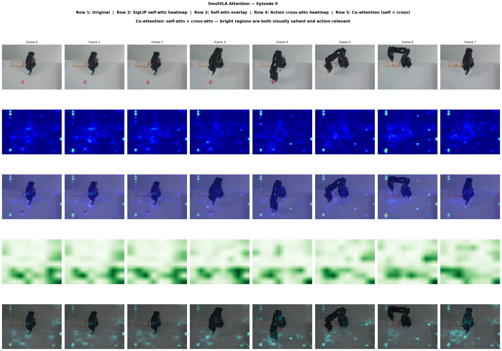
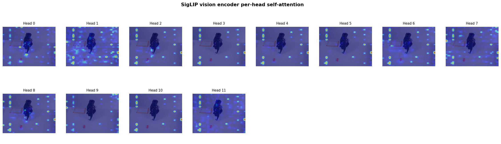

# smolvla-inspect

See what SmolVLA's vision encoder and action expert are looking at when the model predicts robot actions.


*5-row attention grid for a pick-and-place episode. Row 1: original frames. Row 2: SigLIP self-attention heatmap. Row 3: self-attention overlay. Row 4: action cross-attention heatmap. Row 5: co-attention (self x cross) overlay in cyan.*

---

## What this does

SmolVLA is a **vision-language-action** policy: it takes camera images and a language instruction, then outputs robot actions. This tool has two modes:

1. **Attention visualization** (default) -- extracts and visualizes attention heatmaps showing where the model looks
2. **Model health diagnostics** (`--model-health`) -- runs spectral analysis, attention entropy, and head redundancy checks across all model components

### Attention visualization

Extracts attention maps from two places:

1. **SigLIP vision encoder** (self-attention) -- which image patches the encoder considers important during feature extraction
2. **Action expert** (cross-attention) -- which image regions the action decoder actually reads when predicting actions

That lets you check whether the model attends to task-relevant regions (gripper, object, goal) or background (walls, table texture) -- useful for debugging overfitting or distribution shift.

**Input:** A pretrained or fine-tuned SmolVLA policy + a LeRobot dataset (e.g. episodes of pick-and-place).
**Output:** A multi-row grid PNG per episode, optional per-frame PNGs, an optional per-head attention grid, and a positional baseline diagnostic (`positional_baseline.png`) showing the position-dependent attention pattern that gets subtracted.

### Model health diagnostics

Runs three diagnostic checks across all model components (SigLIP vision encoder, VLM text model, action expert, connector, and projection heads):

1. **Weight spectral analysis** -- fits a power-law to singular values of each weight matrix using WeightWatcher. The alpha exponent indicates training quality (2-4 = healthy, >6 = severely undertrained).
2. **Attention entropy** -- measures how focused or diffuse each attention head is across three attention operations: SigLIP self-attention, VLM+Expert joint self-attention, and Expert-to-VLM cross-attention.
3. **Head redundancy** -- measures pairwise cosine similarity between attention heads within each layer. High similarity means wasted capacity.

**Output:** Terminal report, markdown report (`model_health_report.md`), and a 3-panel plot (`model_health_report.png`).


*Example 3-panel health report: spectral alpha distribution, attention entropy by layer, and head redundancy matrix. See the full [markdown report](assets/example_health_report.md) for per-layer details.*

For a detailed visual walkthrough of the architecture and how it maps to the report, see **[Architecture Diagrams](assets/architecture.md)**.

---

## How it works


*Left: Where the vision encoder lives and where we hook to capture attention. Right: How attention weights become a spatial heatmap.*

### Pipeline

1. **Load model and dataset** -- loads a SmolVLA policy (e.g. `lerobot/smolvla_base`) and a LeRobot dataset. The dataset provides image sequences; the script uses images as input and runs inference.

2. **Capture self-attention from SigLIP** -- the vision encoder (SigLIP ViT, 12 layers, 12 heads) splits each image into patches (32x32 grid for 512px images with 16px patches) and runs self-attention. Forward hooks on the attention layers capture the weight matrices.

3. **Aggregate across layers** (`--method`):
   - `last-layer` -- uses only the final encoder layer
   - `rollout` -- multiplies attention across all layers with residual connections, giving a more complete picture of information flow
   - `all-layers` -- keeps each layer separately

4. **Capture cross-attention** (`--cross-attention`) -- SmolVLA's VLM builds a KV cache from the prefix (vision + language + state tokens). The action expert queries that cache. The script monkey-patches `eager_attention_forward()` on the expert layers to intercept the softmax attention when expert Q attends to prefix K. Only columns corresponding to vision tokens are kept, giving a heatmap of which image regions the action decoder reads.

5. **Turn attention into spatial heatmaps** -- patch-level importance scores are reshaped into a 2D grid, upsampled with bilinear interpolation to image size, and normalized to [0, 1]. A percentile threshold (`--attn-threshold`, default 0.5) then zeros out low-attention values to suppress residual positional noise from SigLIP's learned position embeddings, and re-normalizes the remainder.

6. **Visualize** -- the output grid has up to 5 rows per frame:

| Row | Content | Colormap |
|-----|---------|----------|
| 1 | Original frame | -- |
| 2 | SigLIP self-attention heatmap | jet (blue-to-red) |
| 3 | Self-attention overlay on frame | jet |
| 4 | Action cross-attention heatmap | Greens |
| 5 | Co-attention overlay (self x cross) | cyan (black-cyan-white) |

Rows 4-5 only appear when cross-attention is enabled. The co-attention overlay multiplies self-attention and cross-attention element-wise, highlighting regions that are **both** visually salient and action-relevant.

### Per-head grid

With `--show-heads`, a separate grid shows each of the 12 SigLIP attention heads individually for the first frame. Each head has its per-head positional baseline subtracted (computed from a gray-image forward pass) so the patterns reflect content-dependent attention rather than position artifacts.


*Each subplot is one attention head. Look for specialization -- e.g. one head tracking the gripper, another tracking the object.*

---

## Setup

**Requirements:** Python 3.10+, and FFmpeg 4-7 for video decoding (LeRobot uses TorchCodec). On macOS, Homebrew's default `ffmpeg` is often v8; install FFmpeg 6:

```bash
brew install ffmpeg@6
```

Then:

```bash
cd smolvla-inspect
python3.11 -m venv .venv && source .venv/bin/activate
pip install -r requirements.txt
```

---

## Run

Use `run.sh` so TorchCodec finds FFmpeg 6's libs:

```bash
source .venv/bin/activate
./run.sh
```

Or set the library path yourself:

```bash
export DYLD_LIBRARY_PATH="/opt/homebrew/opt/ffmpeg@6/lib:$DYLD_LIBRARY_PATH"
python inspect_attention.py
```

### Examples

```bash
# Default: rollout aggregation + cross-attention + per-head grid
./run.sh

# Your fine-tuned model
./run.sh --model path/to/finetuned_checkpoint --dataset path/to/dataset

# More frames, specific episode
./run.sh --episode 3 --num-frames 12

# Last-layer method instead of rollout
./run.sh --method last-layer

# Skip cross-attention capture (faster, omits rows 4-5)
./run.sh --no-cross-attention

# Skip per-head attention grid
./run.sh --no-show-heads

# Raw attention without positional baseline subtraction
./run.sh --raw-attention

# Higher threshold to suppress more positional noise (default 0.5)
./run.sh --attn-threshold 0.7

# No threshold (show all baseline-subtracted values)
./run.sh --attn-threshold 0

# Model health diagnostics (spectral analysis + entropy + redundancy)
./run.sh --model-health

# Health check with more sample frames for stable entropy estimates
./run.sh --model-health --health-frames 10

# Custom thresholds for health warnings
./run.sh --model-health --entropy-warn 0.85 --redundancy-warn 0.75

# Explicit device override (auto-detected by default: mps > cuda > cpu)
./run.sh --device cuda
```

Results land in `outputs/`.

### CLI flags

**Attention visualization:**

| Flag | Default | Description |
|------|---------|-------------|
| `--model` | `lerobot/smolvla_base` | HuggingFace model ID or local path |
| `--dataset` | `lerobot/svla_so101_pickplace` | LeRobot dataset ID or local path |
| `--episode` | `0` | Episode index to visualize |
| `--num-frames` | `8` | Number of frames to sample |
| `--image-key` | auto-detected | Dataset image key override |
| `--output-dir` | `./outputs` | Output directory |
| `--device` | `auto` | `auto`, `cpu`, `cuda`, or `mps` |
| `--save-individual` | `true` | Save each frame as a separate PNG |
| `--method` | `rollout` | `last-layer`, `rollout`, or `all-layers` |
| `--cross-attention` | `true` | Capture action-expert cross-attention |
| `--show-heads` | `true` | Save per-head attention grid for first frame |
| `--raw-attention` | `false` | Skip positional baseline subtraction |
| `--attn-threshold` | `0.5` | Percentile (0-1) below which attention values are zeroed to suppress positional noise |

**Model health diagnostics:**

| Flag | Default | Description |
|------|---------|-------------|
| `--model-health` | `false` | Run health diagnostics instead of attention heatmaps |
| `--health-frames` | `5` | Number of sample frames for entropy/redundancy |
| `--entropy-warn` | `0.8` | Entropy ratio threshold for "unfocused" warning |
| `--entropy-critical` | `0.95` | Entropy ratio threshold for "dead" heads |
| `--entropy-low` | `0.1` | Entropy ratio threshold for "collapsed" heads |
| `--redundancy-warn` | `0.7` | Cosine similarity threshold for "high redundancy" |
| `--redundancy-critical` | `0.9` | Cosine similarity threshold for "collapsed" heads |

Defaults can be changed in `configs/defaults.yaml`.

---

## What to look for

### Self-attention (SigLIP vision encoder -- rows 2-3)

| Attention pattern | Interpretation |
|-------------------|----------------|
| Bright on gripper + object + goal | **Healthy** -- model attends to task-relevant regions |
| Bright on shelves, cables, table grain | **Background overfitting** -- model may be using scene cues |
| Uniform / diffuse everywhere | Model may not have learned focused visual features yet |
| Shifts from background to object across frames | Model is tracking the task over time (good sign) |

### Cross-attention (action expert -- rows 4-5)

| Attention pattern | Interpretation |
|-------------------|----------------|
| Tight focus on gripper tip + target object | **Healthy** -- action decoder reads exactly what it needs |
| Diffuse across all vision tokens | Decoder hasn't specialized; may predict generic actions |
| Self-attn diffuse but cross-attn focused | Decoder learned to select useful tokens despite a noisy encoder |
| Self-attn focused but cross-attn diffuse | Encoder features are good but the decoder doesn't exploit them |

### Co-attention (row 5)

The cyan overlay highlights regions where **both** the vision encoder and the action expert agree something is important. Bright cyan = high self-attention AND high cross-attention. This is the strongest signal for task-relevant regions.

### Per-head patterns

Look for heads that specialize: one head tracking the gripper, another tracking the object, another attending globally. Specialization is a sign of a well-trained encoder. Heads that all look identical suggest the model hasn't learned diverse attention strategies.

### Model health report

| Metric | Healthy | Warning | Critical |
|--------|---------|---------|----------|
| Spectral alpha | 2-4 | 4-6 (undertrained) | >6 (severely undertrained) or <2 (overcorrelated) |
| Attention entropy | 0.10-0.80 | >0.80 (unfocused) | >0.95 (dead) or <0.10 (collapsed) |
| Head redundancy | <0.70 (diverse) | >0.70 (redundant) | >0.90 (collapsed) |

The report covers three attention components mapped to distinct operations in the architecture:

| Report component | Architecture operation | When it runs |
|-----------------|----------------------|-------------|
| SigLIP Vision (12L, 12H) | Self-attention inside the vision encoder | Image encoding |
| VLM+Expert Joint Self-Attn (16L, 15H) | VLM and Expert tokens concatenated, attend to each other | Prefill (initial encoding) |
| Expert-to-VLM Cross-Attn (16L, 8H) | Expert queries VLM's cached keys/values | Generation (action decoding, 10 steps) |

See **[Architecture Diagrams](assets/architecture.md)** for visual explanations of each component.

---

## Project layout

```
smolvla-inspect/
├── inspect_attention.py      # All logic: model loading, hooks, heatmaps, health diagnostics
├── assets/
│   ├── architecture.md       # Architecture diagrams and report reference
│   ├── how_it_works_architecture.png
│   ├── example_grid.png
│   └── example_per_head.png
├── configs/
│   └── defaults.yaml         # Default CLI values (model, dataset, method, flags)
├── docs/
│   ├── ELI5.md               # Plain-language explanation of the interpretability approach
│   └── TESTING.md            # CLI test commands and expected output
├── outputs/                  # Generated images and reports (gitignored)
│   ├── positional_baseline.png
│   ├── model_health_report.md
│   └── model_health_report.png
├── run.sh                    # Wrapper that sets FFmpeg lib path
├── requirements.txt
└── README.md
```

---

## Roadmap

Attention maps show where the model allocates compute, but not whether those regions actually drive the output. The following interpretability methods would complement the current tooling:

- [ ] **Gradient-based attribution** -- compute `d(action) / d(patch_embedding)` via vanilla saliency, GradCAM, or Integrated Gradients to measure which image patches *causally influence* the predicted action (not just where attention points)
- [ ] **Occlusion / perturbation sensitivity** -- mask out image regions or zero out specific prefix tokens (vision, language, state) and measure action MSE change; model-agnostic and directly answers "if I cover the gripper, does the model break?"
- [ ] **Representation probing** -- train small linear classifiers on intermediate layer representations to test what information is encoded at each stage (e.g., can layer N predict object position? does the Expert encode gripper state?)
- [ ] **Causal tracing / activation patching** -- replace activations at specific (layer, token) positions with corrupted versions and measure output change; builds a causal map of information flow through the model
- [ ] **Temporal consistency analysis** -- track attention patterns across frames in an episode to check if attention follows the object smoothly, whether cross-attention shifts predict upcoming actions, and correlation between attention movement and action direction

---

## Note on FFmpeg

If you installed `ffmpeg@6` and linked it (`brew link --overwrite ffmpeg@6`), your default `ffmpeg` is now 6.x. To switch back later: `brew unlink ffmpeg@6 && brew link ffmpeg`.
